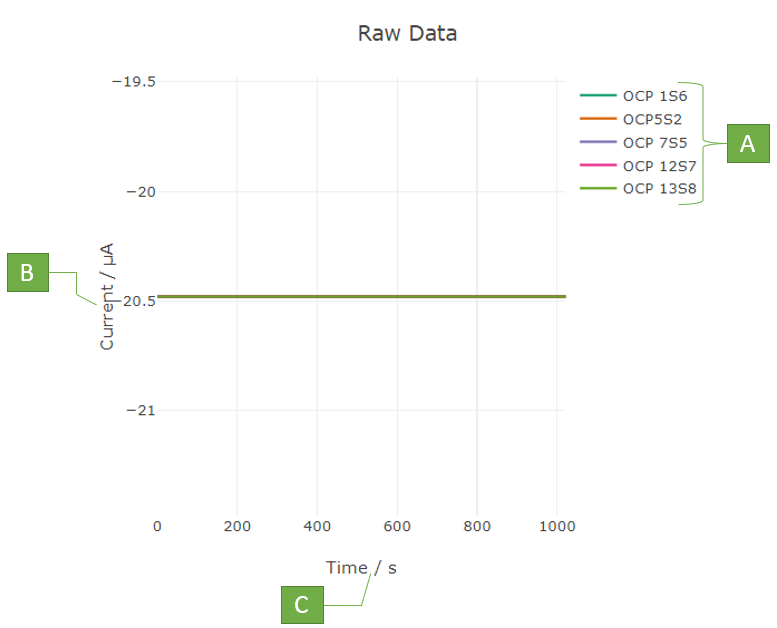

`Media,Examples`

# Raw Graph

It is the graphical representation of the Raw data.

A. **Open circuit potentials:** Each color represents a different potential in the plot.

B. **Y-axis:** Magnitude of current. The units and range can be modified in 'Plot Properties -> Units'

C.  **X-axis:** Time in seconds.

[https://www.youtube.com/watch?v=B6uVRVLYjJs]()